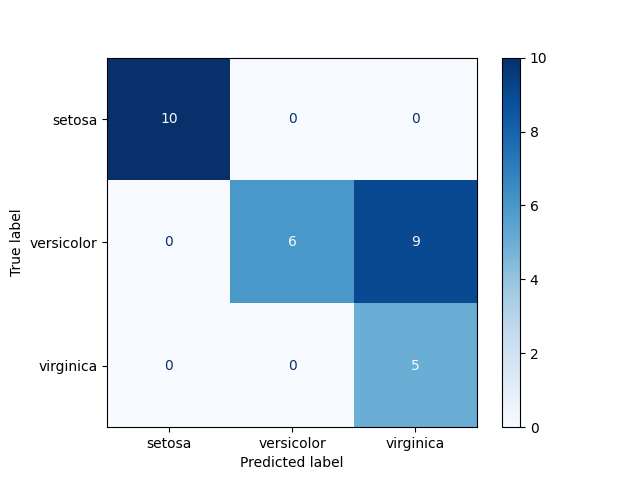
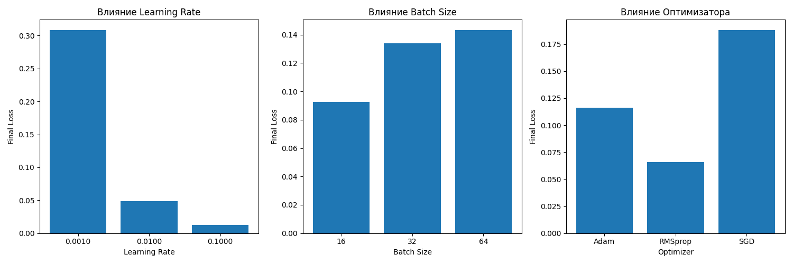
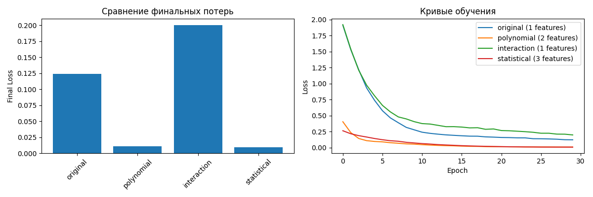

## Задание 1: Модификация существующих моделей (30 баллов)

```
import os
import logging
import torch
import torch.nn as nn
import torch.optim as optim
from torch.utils.data import DataLoader
import numpy as np
import matplotlib.pyplot as plt
from sklearn.metrics import precision_score, recall_score, f1_score, roc_auc_score, confusion_matrix, \
    ConfusionMatrixDisplay

from regression_basics.utils import make_regression_data, make_classification_data, mse, RegressionDataset, \
    ClassificationDataset
    
logging.basicConfig(level=logging.INFO, format='%(asctime)s - %(levelname)s - %(message)s')
logger = logging.getLogger(__name__)


def save_model(model, model_name, metrics=None):
    """Сохраняет модель в директорию models/"""
    os.makedirs('models', exist_ok=True)
    model_path = f'models/{model_name}.pth'

    torch.save({
        'model_state_dict': model.state_dict(),
        'model_class': model.__class__.__name__,
        'input_features': model.linear.in_features,
        'metrics': metrics or {}
    }, model_path)

    logger.info(f"Модель сохранена: {model_path}")
    return model_path


def load_model(model_class, model_name, in_features):
    """Загружает модель из директории models/"""
    model_path = f'models/{model_name}.pth'

    if not os.path.exists(model_path):
        raise FileNotFoundError(f"Модель не найдена: {model_path}")

    checkpoint = torch.load(model_path)
    model = model_class(in_features=in_features)
    model.load_state_dict(checkpoint['model_state_dict'])

    logger.info(f"Модель загружена: {model_path}")
    return model, checkpoint.get('metrics', {})

```


### 1.1 Модифицированная линейная регрессия с L1/L2 и early stopping

```
class LinearRegressionReg(nn.Module):
    def __init__(self, in_features, l1=0.0, l2=0.0):
        super().__init__()
        self.linear = nn.Linear(in_features, 1)
        self.l1 = l1
        self.l2 = l2

    def forward(self, x):
        return self.linear(x)

    def regularization_loss(self):
        l1_loss = self.l1 * torch.norm(self.linear.weight, 1)
        l2_loss = self.l2 * torch.norm(self.linear.weight, 2)
        return l1_loss + l2_loss


def train_linreg_with_early_stopping(
        model, dataloader, val_dataloader, epochs=100, lr=0.1, patience=10
):
    criterion = nn.MSELoss()
    optimizer = optim.SGD(model.parameters(), lr=lr)
    best_loss = float('inf')
    patience_counter = 0
    best_state = None

    logger.info("Начинаем обучение линейной регрессии с early stopping")
    
    for epoch in range(1, epochs + 1):
        model.train()
        train_loss = 0
        for X_batch, y_batch in dataloader:
            optimizer.zero_grad()
            y_pred = model(X_batch)
            loss = criterion(y_pred, y_batch) + model.regularization_loss()
            loss.backward()
            optimizer.step()
            train_loss += loss.item()
        # Early stopping по валидационной выборке
        model.eval()
        val_losses = []
        with torch.no_grad():
            for X_val, y_val in val_dataloader:
                y_pred = model(X_val)
                val_loss = criterion(y_pred, y_val)
                val_losses.append(val_loss.item())
                
        avg_val_loss = np.mean(val_losses)
        avg_train_loss = train_loss / len(dataloader)

        if avg_val_loss < best_loss:
            best_loss = avg_val_loss
            best_state = model.state_dict()
            patience_counter = 0
        else:
            patience_counter += 1
            if patience_counter >= patience:
                logger.info(f"Early stopping на эпохе {epoch}")
                model.load_state_dict(best_state)
                break
          
        if epoch % 10 == 0:
            logger.info(f'Epoch {epoch}: Train Loss: {avg_train_loss:.4f}, Val Loss: {avg_val_loss:.4f}')

    # Сохраняем лучшую модель
    final_metrics = {'best_val_loss': best_loss, 'epochs_trained': epoch}
    save_model(model, 'linear_regression_best', final_metrics)

    return best_loss

```

### 1.2 Логистическая регрессия с поддержкой мультикласса и метриками

```
class LogisticRegressionMulti(nn.Module):
    def __init__(self, in_features, num_classes):
        super().__init__()
        self.linear = nn.Linear(in_features, num_classes)

    def forward(self, x):
        return self.linear(x)


def train_logreg_multiclass(
        model, dataloader, val_dataloader, epochs=100, lr=0.1
):
    criterion = nn.CrossEntropyLoss()
    optimizer = optim.SGD(model.parameters(), lr=lr)
    logger.info("Начинаем обучение логистической регрессии")
    for epoch in range(1, epochs + 1):
        model.train()
        train_loss = 0
        for X_batch, y_batch in dataloader:
            optimizer.zero_grad()
            logits = model(X_batch)
            loss = criterion(logits, y_batch.squeeze().long())
            loss.backward()
            optimizer.step()
            train_loss += loss.item()

        if epoch % 20 == 0:
            avg_train_loss = train_loss / len(dataloader)
            logger.info(f'Epoch {epoch}: Train Loss: {avg_train_loss:.4f}')

        # Оценка и сохранение
        precision, recall, f1, roc_auc, _, _ = evaluate_multiclass(model, val_dataloader, num_classes=3)
        metrics = {'precision': precision, 'recall': recall, 'f1': f1, 'roc_auc': roc_auc}
        save_model(model, 'logistic_regression_multiclass', metrics)

        logger.info(f"Финальные метрики: Precision: {precision:.4f}, Recall: {recall:.4f}, F1: {f1:.4f}")

        return metrics

def evaluate_multiclass(model, dataloader, num_classes):
    model.eval()
    y_true = []
    y_pred = []
    y_score = []
    with torch.no_grad():
        for X_batch, y_batch in dataloader:
            logits = model(X_batch)
            probs = torch.softmax(logits, dim=1)
            preds = torch.argmax(probs, dim=1)
            y_true.extend(y_batch.squeeze().cpu().numpy())
            y_pred.extend(preds.cpu().numpy())
            y_score.extend(probs.cpu().numpy())
    y_true = np.array(y_true)
    y_pred = np.array(y_pred)
    y_score = np.array(y_score)
    precision = precision_score(y_true, y_pred, average='macro', zero_division=0)
    recall = recall_score(y_true, y_pred, average='macro', zero_division=0)
    f1 = f1_score(y_true, y_pred, average='macro', zero_division=0)
    # Для ROC-AUC: one-vs-rest
    try:
        roc_auc = roc_auc_score(y_true, y_score, multi_class='ovr')
    except:
        roc_auc = float('nan')
    return precision, recall, f1, roc_auc, y_true, y_pred


def plot_confusion_matrix(y_true, y_pred, class_names=None):
    cm = confusion_matrix(y_true, y_pred)
    disp = ConfusionMatrixDisplay(confusion_matrix=cm, display_labels=class_names)
    disp.plot(cmap=plt.cm.Blues)
    plt.show()


# Пример использования для регрессии:
if __name__ == "__main__":
    os.makedirs('models', exist_ok=True)
    os.makedirs('plots', exist_ok=True)
    # Линейная регрессия с L1/L2 и early stopping
    X, y = make_regression_data(n=200, noise=0.1, source='random')
    dataset = RegressionDataset(X, y)
    train_size = int(0.8 * len(dataset))
    val_size = len(dataset) - train_size
    train_ds, val_ds = torch.utils.data.random_split(dataset, [train_size, val_size])
    train_loader = DataLoader(train_ds, batch_size=32, shuffle=True)
    val_loader = DataLoader(val_ds, batch_size=32)
    model = LinearRegressionReg(in_features=X.shape[1], l1=1e-3, l2=1e-2)
    train_linreg_with_early_stopping(model, train_loader, val_loader, epochs=100, lr=0.1, patience=10)

    # Логистическая регрессия для мультикласса
    from sklearn.datasets import load_iris

    iris = load_iris()
    X = torch.tensor(iris['data'], dtype=torch.float32)
    y = torch.tensor(iris['target'], dtype=torch.int64).unsqueeze(1)
    dataset = ClassificationDataset(X, y)
    train_size = int(0.8 * len(dataset))
    val_size = len(dataset) - train_size
    train_ds, val_ds = torch.utils.data.random_split(dataset, [train_size, val_size])
    train_loader = DataLoader(train_ds, batch_size=32, shuffle=True)
    val_loader = DataLoader(val_ds, batch_size=32)
    model = LogisticRegressionMulti(in_features=X.shape[1], num_classes=3)
    train_logreg_multiclass(model, train_loader, val_loader, epochs=100, lr=0.1)
    precision, recall, f1, roc_auc, y_true, y_pred = evaluate_multiclass(model, val_loader, num_classes=3)
    print(f"Precision: {precision:.4f}, Recall: {recall:.4f}, F1: {f1:.4f}, ROC-AUC: {roc_auc:.4f}")
    plot_confusion_matrix(y_true, y_pred, class_names=iris['target_names'])
```
### Итоговый результат: 

Precision: 0.7857, Recall: 0.8000, F1: 0.6992, ROC-AUC: 0.9876



## Задание 2: Работа с датасетами (30 баллов)


```
import torch
import pandas as pd
import numpy as np
from torch.utils.data import Dataset, DataLoader
from sklearn.preprocessing import StandardScaler, LabelEncoder, OneHotEncoder
from sklearn.model_selection import train_test_split
from sklearn.datasets import fetch_california_housing, load_breast_cancer
import torch.nn as nn
import torch.optim as optim
from sklearn.metrics import mean_squared_error, accuracy_score, classification_report
```

### 2.1 Кастомный Dataset класс для CSV файлов
```
class CSVDataset(Dataset):
    def __init__(self, csv_path=None, X=None, y=None, target_column=None,
                 categorical_columns=None, normalize=True, task_type='regression'):
        """
        csv_path: путь к CSV файлу
        target_column: название целевой колонки
        categorical_columns: список категориальных колонок
        normalize: применять ли нормализацию к числовым признакам
        task_type: 'regression' или 'classification'
        """
        self.task_type = task_type
        self.normalize = normalize
        self.categorical_columns = categorical_columns or []

        if csv_path is not None:
            self.data = pd.read_csv(csv_path)
            self.X = self.data.drop(columns=[target_column])
            self.y = self.data[target_column]
        else:
            self.X = pd.DataFrame(X) if not isinstance(X, pd.DataFrame) else X
            self.y = pd.Series(y) if not isinstance(y, pd.Series) else y

        self._preprocess_data()

    def _preprocess_data(self):
        # Обработка категориальных признаков
        if self.categorical_columns:
            for col in self.categorical_columns:
                if col in self.X.columns:
                    le = LabelEncoder()
                    self.X[col] = le.fit_transform(self.X[col].astype(str))

        # Нормализация числовых признаков
        if self.normalize:
            numeric_columns = self.X.select_dtypes(include=[np.number]).columns
            if len(numeric_columns) > 0:
                scaler = StandardScaler()
                self.X[numeric_columns] = scaler.fit_transform(self.X[numeric_columns])

        # Преобразование в тензоры
        self.X_tensor = torch.tensor(self.X.values, dtype=torch.float32)

        if self.task_type == 'regression':
            self.y_tensor = torch.tensor(self.y.values, dtype=torch.float32).unsqueeze(1)
        else:
            # Для классификации кодируем метки
            if self.y.dtype == 'object':
                le = LabelEncoder()
                y_encoded = le.fit_transform(self.y)
                self.y_tensor = torch.tensor(y_encoded, dtype=torch.float32).unsqueeze(1)
            else:
                self.y_tensor = torch.tensor(self.y.values, dtype=torch.float32).unsqueeze(1)

    def __len__(self):
        return len(self.X_tensor)

    def __getitem__(self, idx):
        return self.X_tensor[idx], self.y_tensor[idx]

    def get_feature_dim(self):
        return self.X_tensor.shape[1]
```
```
# Модели из предыдущего задания
class LinearRegressionReg(nn.Module):
    def __init__(self, in_features, l1=0.0, l2=0.0):
        super().__init__()
        self.linear = nn.Linear(in_features, 1)
        self.l1 = l1
        self.l2 = l2

    def forward(self, x):
        return self.linear(x)

    def regularization_loss(self):
        l1_loss = self.l1 * torch.norm(self.linear.weight, 1)
        l2_loss = self.l2 * torch.norm(self.linear.weight, 2)
        return l1_loss + l2_loss


class LogisticRegressionReg(nn.Module):
    def __init__(self, in_features):
        super().__init__()
        self.linear = nn.Linear(in_features, 1)

    def forward(self, x):
        return self.linear(x)


def train_regression_model(model, train_loader, val_loader, epochs=100, lr=0.01):
    criterion = nn.MSELoss()
    optimizer = optim.Adam(model.parameters(), lr=lr)

    for epoch in range(epochs):
        model.train()
        train_loss = 0
        for X_batch, y_batch in train_loader:
            optimizer.zero_grad()
            y_pred = model(X_batch)
            loss = criterion(y_pred, y_batch) + model.regularization_loss()
            loss.backward()
            optimizer.step()
            train_loss += loss.item()

        if (epoch + 1) % 20 == 0:
            model.eval()
            val_loss = 0
            with torch.no_grad():
                for X_val, y_val in val_loader:
                    y_pred = model(X_val)
                    val_loss += criterion(y_pred, y_val).item()
            print(
                f'Epoch {epoch + 1}: Train Loss: {train_loss / len(train_loader):.4f}, Val Loss: {val_loss / len(val_loader):.4f}')


def train_classification_model(model, train_loader, val_loader, epochs=100, lr=0.01):
    criterion = nn.BCEWithLogitsLoss()
    optimizer = optim.Adam(model.parameters(), lr=lr)

    for epoch in range(epochs):
        model.train()
        train_loss = 0
        for X_batch, y_batch in train_loader:
            optimizer.zero_grad()
            y_pred = model(X_batch)
            loss = criterion(y_pred, y_batch)
            loss.backward()
            optimizer.step()
            train_loss += loss.item()

        if (epoch + 1) % 20 == 0:
            model.eval()
            val_loss = 0
            correct = 0
            total = 0
            with torch.no_grad():
                for X_val, y_val in val_loader:
                    y_pred = model(X_val)
                    val_loss += criterion(y_pred, y_val).item()
                    predicted = (torch.sigmoid(y_pred) > 0.5).float()
                    total += y_val.size(0)
                    correct += (predicted == y_val).sum().item()
            accuracy = correct / total
            print(
                f'Epoch {epoch + 1}: Train Loss: {train_loss / len(train_loader):.4f}, Val Loss: {val_loss / len(val_loader):.4f}, Accuracy: {accuracy:.4f}')
```

### 2.2 Эксперименты с различными датасетами
```
def experiment_regression():
    print("=== Эксперимент с регрессией (California Housing) ===")
    # Загружаем датасет California Housing
    housing = fetch_california_housing()
    X, y = housing.data, housing.target

    # Создаем кастомный датасет
    dataset = CSVDataset(X=X, y=y, task_type='regression')

    # Разделяем на train/val
    train_size = int(0.8 * len(dataset))
    val_size = len(dataset) - train_size
    train_dataset, val_dataset = torch.utils.data.random_split(dataset, [train_size, val_size])

    train_loader = DataLoader(train_dataset, batch_size=64, shuffle=True)
    val_loader = DataLoader(val_dataset, batch_size=64)

    # Обучаем модель
    model = LinearRegressionReg(in_features=dataset.get_feature_dim(), l1=1e-4, l2=1e-3)
    train_regression_model(model, train_loader, val_loader, epochs=100, lr=0.001)


def experiment_classification():
    print("\n=== Эксперимент с классификацией (Breast Cancer) ===")
    # Загружаем датасет Breast Cancer
    cancer = load_breast_cancer()
    X, y = cancer.data, cancer.target

    # Создаем кастомный датасет
    dataset = CSVDataset(X=X, y=y, task_type='classification')

    # Разделяем на train/val
    train_size = int(0.8 * len(dataset))
    val_size = len(dataset) - train_size
    train_dataset, val_dataset = torch.utils.data.random_split(dataset, [train_size, val_size])

    train_loader = DataLoader(train_dataset, batch_size=32, shuffle=True)
    val_loader = DataLoader(val_dataset, batch_size=32)

    # Обучаем модель
    model = LogisticRegressionReg(in_features=dataset.get_feature_dim())
    train_classification_model(model, train_loader, val_loader, epochs=100, lr=0.001)


if __name__ == "__main__":
    # Запускаем эксперименты
    experiment_regression()
    experiment_classification()
```
### Выходные данные: 
```
=== Эксперимент с регрессией (California Housing) ===
Epoch 20: Train Loss: 0.5246, Val Loss: 0.5412
Epoch 40: Train Loss: 0.5233, Val Loss: 0.5428
Epoch 60: Train Loss: 0.5233, Val Loss: 0.5434
Epoch 80: Train Loss: 0.5228, Val Loss: 0.5438
Epoch 100: Train Loss: 0.5234, Val Loss: 0.5448

=== Эксперимент с классификацией (Breast Cancer) ===
Epoch 20: Train Loss: 0.1805, Val Loss: 0.1631, Accuracy: 0.9561
Epoch 40: Train Loss: 0.1224, Val Loss: 0.1134, Accuracy: 0.9737
Epoch 60: Train Loss: 0.0995, Val Loss: 0.0959, Accuracy: 0.9825
Epoch 80: Train Loss: 0.0886, Val Loss: 0.0881, Accuracy: 0.9825
Epoch 100: Train Loss: 0.0792, Val Loss: 0.0841, Accuracy: 0.9825
```

## Задание 3: Эксперименты и анализ (20 баллов)


```
import torch
import torch.nn as nn
import torch.optim as optim
from torch.utils.data import DataLoader
import numpy as np
import pandas as pd
import matplotlib.pyplot as plt
import seaborn as sns
from sklearn.preprocessing import PolynomialFeatures
from sklearn.model_selection import train_test_split
import logging
import unittest
from itertools import combinations
from regression_basics.utils import make_regression_data, make_classification_data, RegressionDataset, \
    ClassificationDataset

# Добавляем логирование
logging.basicConfig(level=logging.INFO, format='%(asctime)s - %(levelname)s - %(message)s')
logger = logging.getLogger(__name__)


class LinearRegressionExp(nn.Module):
    """Линейная регрессия для экспериментов"""

    def __init__(self, in_features):
        super().__init__()
        self.linear = nn.Linear(in_features, 1)

    def forward(self, x):
        return self.linear(x)


class LogisticRegressionExp(nn.Module):
    """Логистическая регрессия для экспериментов"""

    def __init__(self, in_features):
        super().__init__()
        self.linear = nn.Linear(in_features, 1)

    def forward(self, x):
        return self.linear(x)


class HyperparameterExperiment:
    """Класс для проведения экспериментов с гиперпараметрами"""

    def __init__(self, model_class, dataset, task_type='regression'):
        """
        Args:
            model_class: Класс модели (LinearRegressionExp или LogisticRegressionExp)
            dataset: Датасет для экспериментов
            task_type: Тип задачи ('regression' или 'classification')
        """
        self.model_class = model_class
        self.dataset = dataset
        self.task_type = task_type
        self.results = []

    def run_experiment(self, learning_rates, batch_sizes, optimizers, epochs=50):
        """
        Проводит эксперименты с различными гиперпараметрами

        Args:
            learning_rates: Список скоростей обучения
            batch_sizes: Список размеров батчей
            optimizers: Список оптимизаторов
            epochs: Количество эпох
        """
        logger.info("Начинаем эксперименты с гиперпараметрами")

        for lr in learning_rates:
            for batch_size in batch_sizes:
                for opt_name in optimizers:
                    logger.info(f"Эксперимент: lr={lr}, batch_size={batch_size}, optimizer={opt_name}")

                    # Создаем DataLoader
                    dataloader = DataLoader(self.dataset, batch_size=batch_size, shuffle=True)

                    # Создаем модель
                    model = self.model_class(in_features=self.dataset.X.shape[1])

                    # Выбираем оптимизатор
                    if opt_name == 'SGD':
                        optimizer = optim.SGD(model.parameters(), lr=lr)
                    elif opt_name == 'Adam':
                        optimizer = optim.Adam(model.parameters(), lr=lr)
                    elif opt_name == 'RMSprop':
                        optimizer = optim.RMSprop(model.parameters(), lr=lr)

                    # Выбираем функцию потерь
                    if self.task_type == 'regression':
                        criterion = nn.MSELoss()
                    else:
                        criterion = nn.BCEWithLogitsLoss()

                    # Обучаем модель
                    losses = self._train_model(model, dataloader, criterion, optimizer, epochs)

                    # Сохраняем результаты
                    self.results.append({
                        'learning_rate': lr,
                        'batch_size': batch_size,
                        'optimizer': opt_name,
                        'final_loss': losses[-1],
                        'losses': losses
                    })

        logger.info("Эксперименты завершены")

    def _train_model(self, model, dataloader, criterion, optimizer, epochs):
        """Обучает модель и возвращает историю потерь"""
        losses = []

        for epoch in range(epochs):
            epoch_loss = 0
            for X_batch, y_batch in dataloader:
                optimizer.zero_grad()
                y_pred = model(X_batch)
                loss = criterion(y_pred, y_batch)
                loss.backward()
                optimizer.step()
                epoch_loss += loss.item()

            avg_loss = epoch_loss / len(dataloader)
            losses.append(avg_loss)

        return losses

    def visualize_results(self):
        """Визуализирует результаты экспериментов"""
        df = pd.DataFrame(self.results)

        # График 1: Влияние learning rate
        plt.figure(figsize=(15, 5))

        plt.subplot(1, 3, 1)
        lr_results = df.groupby('learning_rate')['final_loss'].mean()
        plt.bar(range(len(lr_results)), lr_results.values)
        plt.xticks(range(len(lr_results)), [f'{lr:.4f}' for lr in lr_results.index])
        plt.title('Влияние Learning Rate')
        plt.xlabel('Learning Rate')
        plt.ylabel('Final Loss')

        # График 2: Влияние batch size
        plt.subplot(1, 3, 2)
        batch_results = df.groupby('batch_size')['final_loss'].mean()
        plt.bar(range(len(batch_results)), batch_results.values)
        plt.xticks(range(len(batch_results)), batch_results.index)
        plt.title('Влияние Batch Size')
        plt.xlabel('Batch Size')
        plt.ylabel('Final Loss')

        # График 3: Влияние оптимизатора
        plt.subplot(1, 3, 3)
        opt_results = df.groupby('optimizer')['final_loss'].mean()
        plt.bar(range(len(opt_results)), opt_results.values)
        plt.xticks(range(len(opt_results)), opt_results.index)
        plt.title('Влияние Оптимизатора')
        plt.xlabel('Optimizer')
        plt.ylabel('Final Loss')

        plt.tight_layout()
        plt.savefig('plots/hyperparameter_results.png')
        plt.show()


class FeatureEngineering:
    """Класс для создания новых признаков"""

    def __init__(self, X, y):
        """
        Args:
            X: Исходные признаки
            y: Целевая переменная
        """
        self.X_original = X
        self.y = y

    def create_polynomial_features(self, degree=2):
        """
        Создает полиномиальные признаки

        Args:
            degree: Степень полинома

        Returns:
            X_poly: Данные с полиномиальными признаками
        """
        logger.info(f"Создание полиномиальных признаков степени {degree}")
        poly = PolynomialFeatures(degree=degree, include_bias=False)
        X_poly = poly.fit_transform(self.X_original.numpy())
        return torch.tensor(X_poly, dtype=torch.float32)

    def create_interaction_features(self):
        """
        Создает признаки взаимодействия между исходными признаками

        Returns:
            X_interaction: Данные с признаками взаимодействия
        """
        logger.info("Создание признаков взаимодействия")
        X_np = self.X_original.numpy()
        n_features = X_np.shape[1]

        # Создаем все возможные парные взаимодействия
        interactions = []
        for i, j in combinations(range(n_features), 2):
            interactions.append((X_np[:, i] * X_np[:, j]).reshape(-1, 1))

        if interactions:
            X_interactions = np.hstack(interactions)
            X_combined = np.hstack([X_np, X_interactions])
        else:
            X_combined = X_np

        return torch.tensor(X_combined, dtype=torch.float32)

    def create_statistical_features(self, window_size=5):
        """
        Создает статистические признаки (среднее, дисперсия)

        Args:
            window_size: Размер окна для вычисления статистик

        Returns:
            X_stats: Данные со статистическими признаками
        """
        logger.info("Создание статистических признаков")
        X_np = self.X_original.numpy()

        # Вычисляем скользящее среднее и дисперсию
        means = []
        stds = []

        for i in range(len(X_np)):
            start_idx = max(0, i - window_size + 1)
            end_idx = i + 1
            window_data = X_np[start_idx:end_idx]

            means.append(np.mean(window_data, axis=0))
            stds.append(np.std(window_data, axis=0))

        means = np.array(means)
        stds = np.array(stds)

        X_combined = np.hstack([X_np, means, stds])
        return torch.tensor(X_combined, dtype=torch.float32)

    def compare_features(self, model_class, task_type='regression', epochs=50):
        """
        Сравнивает качество модели с различными наборами признаков

        Args:
            model_class: Класс модели
            task_type: Тип задачи
            epochs: Количество эпох обучения

        Returns:
            results: Словарь с результатами сравнения
        """
        logger.info("Сравнение различных наборов признаков")

        feature_sets = {
            'original': self.X_original,
            'polynomial': self.create_polynomial_features(degree=2),
            'interaction': self.create_interaction_features(),
            'statistical': self.create_statistical_features()
        }

        results = {}

        for name, X_features in feature_sets.items():
            logger.info(f"Обучение модели с признаками: {name}")

            # Создаем датасет
            if task_type == 'regression':
                dataset = RegressionDataset(X_features, self.y)
                criterion = nn.MSELoss()
            else:
                dataset = ClassificationDataset(X_features, self.y)
                criterion = nn.BCEWithLogitsLoss()

            dataloader = DataLoader(dataset, batch_size=32, shuffle=True)

            # Создаем и обучаем модель
            model = model_class(in_features=X_features.shape[1])
            optimizer = optim.Adam(model.parameters(), lr=0.01)

            losses = []
            for epoch in range(epochs):
                epoch_loss = 0
                for X_batch, y_batch in dataloader:
                    optimizer.zero_grad()
                    y_pred = model(X_batch)
                    loss = criterion(y_pred, y_batch)
                    loss.backward()
                    optimizer.step()
                    epoch_loss += loss.item()

                losses.append(epoch_loss / len(dataloader))

            results[name] = {
                'final_loss': losses[-1],
                'losses': losses,
                'n_features': X_features.shape[1]
            }

        return results

    def visualize_feature_comparison(self, results):
        """Визуализирует сравнение различных наборов признаков"""
        plt.figure(figsize=(12, 4))

        # График 1: Финальные потери
        plt.subplot(1, 2, 1)
        names = list(results.keys())
        final_losses = [results[name]['final_loss'] for name in names]
        plt.bar(names, final_losses)
        plt.title('Сравнение финальных потерь')
        plt.ylabel('Final Loss')
        plt.xticks(rotation=45)

        # График 2: Кривые обучения
        plt.subplot(1, 2, 2)
        for name in names:
            plt.plot(results[name]['losses'], label=f"{name} ({results[name]['n_features']} features)")
        plt.title('Кривые обучения')
        plt.xlabel('Epoch')
        plt.ylabel('Loss')
        plt.legend()

        plt.tight_layout()
        plt.savefig('plots/feature_comparison.png')
        plt.show()
```


### 3.1 Исследование гиперпараметров (10 баллов)
```
def run_hyperparameter_experiments():
    """Проводит эксперименты с гиперпараметрами"""
    logger.info("Запуск экспериментов с гиперпараметрами")

    # Создаем данные для регрессии
    X, y = make_regression_data(n=500, source='random')
    dataset = RegressionDataset(X, y)

    # Настройки экспериментов
    learning_rates = [0.001, 0.01, 0.1]
    batch_sizes = [16, 32, 64]
    optimizers = ['SGD', 'Adam', 'RMSprop']

    # Проводим эксперименты
    experiment = HyperparameterExperiment(LinearRegressionExp, dataset, 'regression')
    experiment.run_experiment(learning_rates, batch_sizes, optimizers, epochs=30)
    experiment.visualize_results()

    return experiment.results
```

### 3.2 Feature Engineering
```
def run_feature_engineering_experiments():
    """Проводит эксперименты с feature engineering"""
    logger.info("Запуск экспериментов с feature engineering")

    # Создаем данные
    X, y = make_regression_data(n=300, source='random')

    # Создаем объект для feature engineering
    fe = FeatureEngineering(X, y)

    # Сравниваем различные наборы признаков
    results = fe.compare_features(LinearRegressionExp, task_type='regression', epochs=30)
    fe.visualize_feature_comparison(results)

    return results
```

### Unit тесты
```
class TestExperiments(unittest.TestCase):
    """Unit тесты для критических функций"""

    def setUp(self):
        """Подготовка данных для тестов"""
        self.X, self.y = make_regression_data(n=100, source='random')
        self.fe = FeatureEngineering(self.X, self.y)

    def test_polynomial_features(self):
        """Тест создания полиномиальных признаков"""
        X_poly = self.fe.create_polynomial_features(degree=2)
        self.assertGreater(X_poly.shape[1], self.X.shape[1])
        self.assertEqual(X_poly.shape[0], self.X.shape[0])

    def test_interaction_features(self):
        """Тест создания признаков взаимодействия"""
        X_interact = self.fe.create_interaction_features()
        self.assertGreaterEqual(X_interact.shape[1], self.X.shape[1])
        self.assertEqual(X_interact.shape[0], self.X.shape[0])

    def test_statistical_features(self):
        """Тест создания статистических признаков"""
        X_stats = self.fe.create_statistical_features()
        self.assertGreater(X_stats.shape[1], self.X.shape[1])
        self.assertEqual(X_stats.shape[0], self.X.shape[0])
```

### Запуск проги:
```
if __name__ == "__main__":
    # Создаем директории для сохранения результатов
    import os
    os.makedirs('plots', exist_ok=True)

    # Запускаем эксперименты
    print("=== Эксперименты с гиперпараметрами ===")
    hyperparams_results = run_hyperparameter_experiments()

    print("\n=== Эксперименты с Feature Engineering ===")
    feature_results = run_feature_engineering_experiments()

    # Запускаем тесты
    print("\n=== Запуск unit тестов ===")
    unittest.main(argv=[''], exit=False, verbosity=2)

```
### Вывод экспериментов:




### Результаты логов и результаты тестов: 

```
=== Эксперименты с гиперпараметрами ===
2025-07-02 22:09:46,177 - INFO - Запуск экспериментов с гиперпараметрами
2025-07-02 22:09:46,178 - INFO - Начинаем эксперименты с гиперпараметрами
2025-07-02 22:09:46,178 - INFO - Эксперимент: lr=0.001, batch_size=16, optimizer=SGD
2025-07-02 22:09:47,232 - INFO - Эксперимент: lr=0.001, batch_size=16, optimizer=Adam
2025-07-02 22:09:47,535 - INFO - Эксперимент: lr=0.001, batch_size=16, optimizer=RMSprop
2025-07-02 22:09:47,813 - INFO - Эксперимент: lr=0.001, batch_size=32, optimizer=SGD
2025-07-02 22:09:47,953 - INFO - Эксперимент: lr=0.001, batch_size=32, optimizer=Adam
2025-07-02 22:09:48,133 - INFO - Эксперимент: lr=0.001, batch_size=32, optimizer=RMSprop
2025-07-02 22:09:48,294 - INFO - Эксперимент: lr=0.001, batch_size=64, optimizer=SGD
2025-07-02 22:09:48,387 - INFO - Эксперимент: lr=0.001, batch_size=64, optimizer=Adam
2025-07-02 22:09:48,503 - INFO - Эксперимент: lr=0.001, batch_size=64, optimizer=RMSprop
2025-07-02 22:09:48,613 - INFO - Эксперимент: lr=0.01, batch_size=16, optimizer=SGD
2025-07-02 22:09:48,830 - INFO - Эксперимент: lr=0.01, batch_size=16, optimizer=Adam
2025-07-02 22:09:49,131 - INFO - Эксперимент: lr=0.01, batch_size=16, optimizer=RMSprop
2025-07-02 22:09:49,406 - INFO - Эксперимент: lr=0.01, batch_size=32, optimizer=SGD
2025-07-02 22:09:49,548 - INFO - Эксперимент: lr=0.01, batch_size=32, optimizer=Adam
2025-07-02 22:09:49,733 - INFO - Эксперимент: lr=0.01, batch_size=32, optimizer=RMSprop
2025-07-02 22:09:49,897 - INFO - Эксперимент: lr=0.01, batch_size=64, optimizer=SGD
2025-07-02 22:09:49,993 - INFO - Эксперимент: lr=0.01, batch_size=64, optimizer=Adam
2025-07-02 22:09:50,112 - INFO - Эксперимент: lr=0.01, batch_size=64, optimizer=RMSprop
2025-07-02 22:09:50,225 - INFO - Эксперимент: lr=0.1, batch_size=16, optimizer=SGD
2025-07-02 22:09:50,443 - INFO - Эксперимент: lr=0.1, batch_size=16, optimizer=Adam
2025-07-02 22:09:50,748 - INFO - Эксперимент: lr=0.1, batch_size=16, optimizer=RMSprop
2025-07-02 22:09:51,025 - INFO - Эксперимент: lr=0.1, batch_size=32, optimizer=SGD
2025-07-02 22:09:51,161 - INFO - Эксперимент: lr=0.1, batch_size=32, optimizer=Adam
2025-07-02 22:09:51,335 - INFO - Эксперимент: lr=0.1, batch_size=32, optimizer=RMSprop
2025-07-02 22:09:51,500 - INFO - Эксперимент: lr=0.1, batch_size=64, optimizer=SGD
2025-07-02 22:09:51,595 - INFO - Эксперимент: lr=0.1, batch_size=64, optimizer=Adam
2025-07-02 22:09:51,712 - INFO - Эксперимент: lr=0.1, batch_size=64, optimizer=RMSprop
2025-07-02 22:09:51,821 - INFO - Эксперименты завершены

=== Запуск unit тестов ===
test_interaction_features (__main__.TestExperiments.test_interaction_features)
Тест создания признаков взаимодействия ... 2025-07-02 22:52:42,122 - INFO - Создание признаков взаимодействия
ok
test_polynomial_features (__main__.TestExperiments.test_polynomial_features)
Тест создания полиномиальных признаков ... 2025-07-02 22:52:42,125 - INFO - Создание полиномиальных признаков степени 2
ok
test_statistical_features (__main__.TestExperiments.test_statistical_features)
Тест создания статистических признаков ... 2025-07-02 22:52:42,141 - INFO - Создание статистических признаков
ok

----------------------------------------------------------------------
Ran 3 tests in 0.032s

OK

```